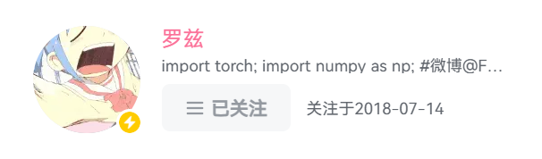

# [BiliFavDate](https://greasyfork.org/zh-CN/scripts/545120-b%E7%AB%99%E6%94%B6%E8%97%8F%E5%A4%B9%E6%94%B6%E8%97%8F%E6%97%B6%E9%97%B4%E6%98%BE%E7%A4%BA)

本脚本实现了三个功能：

- 显示B站收藏夹中隐藏为“收藏于2年前”的视频的真实收藏时间；
- 在关注列表中添加“关注于yyyy-mm-dd”的信息；
- 在“我的粉丝”中添加“关注于yyyy-mm-dd”的信息。

对于第二个功能，由于在分组的关注中请求的数据并不包含关注时间，所以此功能仅在“全部关注”中生效。

第三个功能我也不知道到底谁会需要，但是粉丝列表和关注列表的网页结构是一样的，请求响应的数据结构也是一样的，所以直接和关注列表的写一起了，正好感觉这里用“关注于”也没什么问题。

#### 效果展示

 
Fig.1 收藏夹效果

 
Fig.2 关注列表效果

粉丝列表的效果于关注列表相同，不再单独展示。
